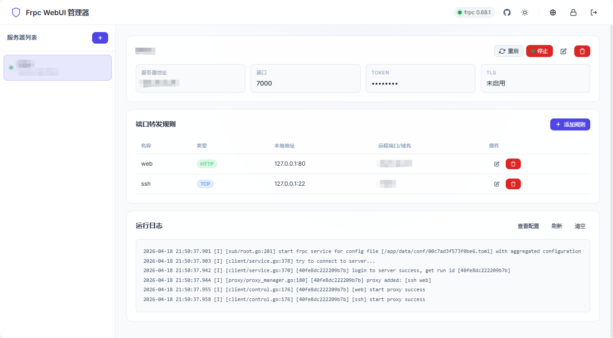

# Frpc WebUI

一个轻量级的 FRP 客户端 Web 管理界面，通过 Docker 部署，让你无需编辑配置文件即可管理 frpc。

> 本项目基于 [ZhensJoke/fnos-frpc](https://github.com/ZhensJoke/fnos-frpc) 修改而来，感谢原作者的开源贡献。



## 为什么选择 Frpc WebUI？

| 特性 | 说明 |
|------|------|
| 🐳 **Docker 部署** | 一键部署，支持 AMD64 / ARM64 架构 |
| 🖥️ **Web 界面** | 图形化配置，告别手动编辑配置文件 |
| 📦 **frpc 管理** | 支持在线下载或本地上传 frpc 二进制 |
| 📡 **多服务器** | 同时管理多个 frps 服务器 |
| 🔄 **多协议** | 支持 TCP / UDP / HTTP / HTTPS 代理 |
| 🔒 **安全** | 密码保护，支持修改密码，数据本地存储 |
| 💾 **轻量** | 镜像仅 ~2-3MB |

## 快速开始

### Docker Run

```bash
docker run -d \
  --name frpc-webui \
  --network host \
  -v ./data:/app/data \
  -e WEB_PORT=7500 \
  -e TZ=Asia/Shanghai \
  --restart unless-stopped \
  frpc-webui:latest
```

### 访问界面

打开浏览器访问：

```
http://你的服务器IP:7500
```

## 使用指南

### 1️⃣ 设置密码

首次访问需要设置管理密码（至少 6 位）。登录后可随时通过顶部导航栏的锁图标修改密码。

### 2️⃣ 安装 frpc

点击右上角的 **🌐** 按钮：

- **在线安装** - 自动从 GitHub 下载最新版 frpc
- **本地上传** - 上传 frpc 压缩包（适合无法访问 GitHub 的环境）

> frpc 下载地址：https://github.com/fatedier/frp/releases

### 3️⃣ 添加服务器

点击 **+** 添加你的 frps 服务器：

```
名称：我的服务器
地址：frps.example.com
端口：7000
Token：your_token
```

### 4️⃣ 配置代理

添加需要穿透的服务：

| 类型 | 用途 | 示例 |
|------|------|------|
| TCP | SSH 远程连接 | 本地 22 端口 → 远程 6022 端口 |
| HTTP | Web 服务 | 本地 80 端口 → 域名绑定 |
| HTTPS | 安全 Web | 本地 443 端口 → 域名绑定 |

### 5️⃣ 启动连接

点击「启动」按钮，查看实时日志确认连接状态。支持启动、停止、重启操作。

### 6️⃣ 日志与配置

- **运行日志** - 实时查看 frpc 输出，支持刷新和清空
- **查看配置** - 查看当前生成的 frpc.toml 配置内容

## 配置选项

### 环境变量

| 变量 | 默认值 | 说明 |
|------|--------|------|
| `WEB_PORT` | `7500` | Web 界面端口 |
| `DATA_DIR` | `/app/data` | 数据存储目录 |
| `TZ` | - | 时区设置 |

### 数据目录

```
data/
├── auth.json       # 管理密码
├── servers.json    # 服务器和代理配置
├── frpc/           # frpc 二进制文件
├── conf/           # 生成的 frpc 配置
└── logs/           # frpc 运行日志
```

## 常用命令

```bash
# 查看日志
docker logs -f frpc-webui

# 重启服务
docker restart frpc-webui

# 停止服务
docker stop frpc-webui
```

## 从源码构建

```bash
git clone https://github.com/lijsjust2/Frpc-WebUI.git
cd frp-web

docker build -t frpc-webui .
```

## 技术栈

- **后端**：Go（静态资源内嵌，零外部依赖）
- **前端**：原生 HTML/CSS/JS（无框架）
- **基础镜像**：scratch（空镜像）

## 致谢

本项目基于 [ZhensJoke/fnos-frpc](https://github.com/ZhensJoke/fnos-frpc) 修改开发，感谢原作者的开源贡献。

## License

MIT
